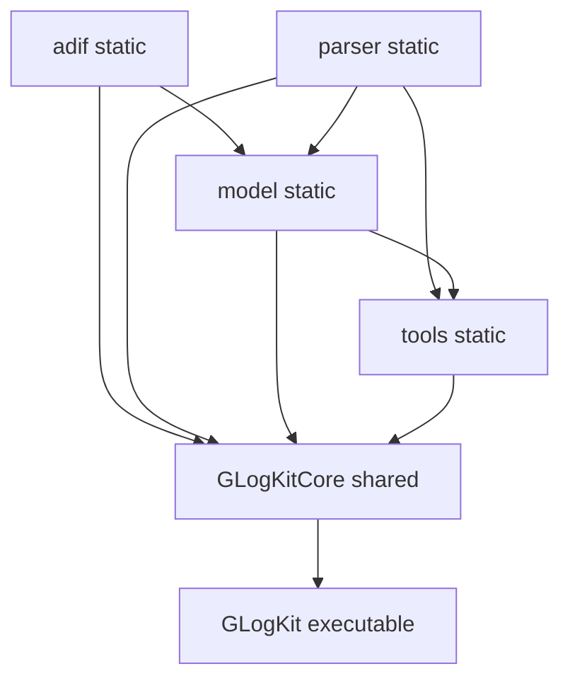

# Architecture

See the repository [README.md](../README.md) for the high-level feature list and directory table. This page describes how those directories relate at build time and how work flows through the stack at runtime.

## CMake targets

| Target | Role |
| -------- | ------ |
| `adif` | Static library: ADIF field value types and bundled constant maps. |
| `parser` | Static library: Flex-generated lexers + Bison-generated parser; exposes `GLOG_PARSER` drivers. |
| `model` | Static library: `GRecord`, SQLite access, import/export and parse services; links `parser` and `adif`. |
| `tools` | Static library: shared widgets, concurrency helpers, `LoadedAwardPlugin`; links `parser` and `model`. |
| `GLogKitCore` | Shared library (`GLogKit::GLogKitCore`): merges GUI sources and the static libraries above. |
| `GLogKit` | Executable: `main.cpp` linked to `GLogKitCore`. |
| `WASPlugin` | Optional `MODULE` under `plugins/was_plugin` (installed as a plugin when `GLOGKIT_INTERNAL_BUILD` is on). |

The root `CMakeLists.txt` sets `GLOGKIT_CORE_MERGED_LIBS` to `adif`, `parser`, `model`, and `tools` so they are linked once into `GLogKitCore` (avoid duplicate symbols in the app or tests).

## Module dependency (build)

The following reflects `target_link_libraries` in each subdirectory `CMakeLists.txt` (not every include edge).

GUI `.cpp` / `.ui` files live under `gui/` but compile into `GLogKitCore`, not a separate CMake target.

## Runtime data flow (import)

1. **UI** - e.g. `GLogApplication::openFileAction` uses `AdifFileService::openFileAsync` (see `gui/GLogApplication.cpp`).
2. **File service** - `AdifFileService` reads the file stream, calls `AdifParseService::parse` (batch mode for whole-file loads), then applies results on the GUI thread via `AdifModel::applyFullLoad` / `applyInsertAt` (see `model/adiffile_service.cpp` and `GLogConcurrent::MainThreadExecutor`).
3. **Parse service** - constructs a `GLOG_PARSER::DriverUnsynchronized` with `LexerBatch` or `LexerInteractive`, runs Bison `Parser`, then converts raw tag/value rows into `GRecord` via `fromRawData` (`model/adifparse_service.cpp`).
4. **Optional backup** - when `AdifModel` holds a `GRecordRepository`, `AdifFileService` can create/find a `files` row and persist records through async DAO calls (`model/adiffile_service.cpp`).

Award evaluation uses a different path: `AwardEntityCountReport` walks records and calls loaded plugins (`gui/GLogApplication.cpp` action for awards, `model/award_entity_count_report.cpp`).

## Threading model (coarse)

- **Repository API** - `GRecordRepository` exposes `QFuture`-based async methods that delegate to `SqliteDbExecutor` on worker threads (`model/recordrepository.h`).
- **GUI updates** - heavy parse results are merged into `AdifModel` on the main thread via explicit dispatch in `AdifFileService` helpers `runApplyFullLoadOnGui` / `runApplyInsertAtOnGui`.
- **Plugins** - `AwardPluginManager` synchronizes the loaded plugin list (`Synchronized<std::vector<LoadedAwardPlugin>>`); install/uninstall paths coordinate with UI locks (see `gui/AwardPluginManager.cpp`).

## Public SDK surface

Installed headers under `include/GLogKit/` (when `DISTRIBUTE_SDK` is enabled) document the small C-facing plugin API (`IGRecord`, `award_plugin.h`) and export macros (`app_export.h`). Most application logic remains in the shared library, not as a stable C++ API for third parties.

## Related reading

- [parser-and-adif.md](parser-and-adif.md) - lexer/parser details.
- [data-model-and-sqlite.md](data-model-and-sqlite.md) - schema and DAO boundaries.
- [plugins.md](plugins.md) - award plugin ABI and loading.
